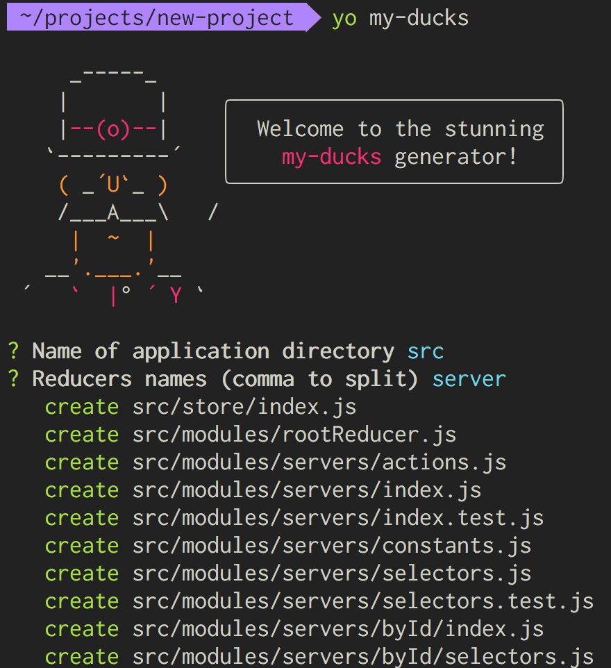
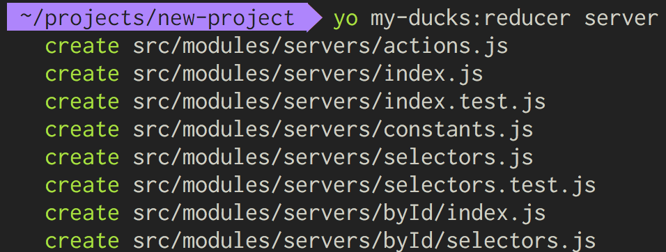
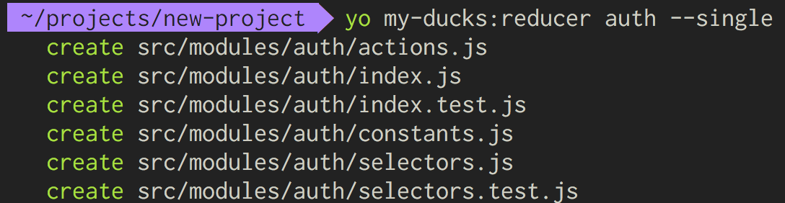

# generator-my-ducks [![NPM version][npm-image]][npm-url] [![Build Status][travis-image]][travis-url] [![Dependency Status][daviddm-image]][daviddm-url] [![devDependencies Status][daviddm-dev-image]][daviddm-dev-url] [![Coverage percentage][coveralls-image]][coveralls-url] [![BCH compliance][bettercodehub-image]][bettercodehub-url] [![Maintainability][codeclimate-maintainability-image]][codeclimate-maintainability-url] [![Test Coverage][codeclimate-coverage-image]][codeclimate-coverage-url]

> Yeoman generator for My Ducks



## Installation

First, install [Yeoman](http://yeoman.io) and generator-my-ducks using [npm](https://www.npmjs.com/) (we assume you have pre-installed [node.js](https://nodejs.org/)).

```bash
npm install -g yo
npm install -g generator-my-ducks
```

Then generate your new project:

```bash
yo my-ducks
```

### Sub generators
##### Reducer



```bash
yo my-ducks:reducer broker
yo my-ducks:reducer broker --srcPath app
yo my-ducks:reducer auth --single
```

Arguments:
- `name` (String) reducer name

Options:
- `srcPath` (String, default: _src_) Name of application directory, priority
  - from cli
  - from config file(.yo-rc.json)
  - default value(scr)
- `single` (Boolean, default: false) Reducer for single element

## Getting To Know Yeoman

 * Yeoman has a heart of gold.
 * Yeoman is a person with feelings and opinions, but is very easy to work with.
 * Yeoman can be too opinionated at times but is easily convinced not to be.
 * Feel free to [learn more about Yeoman](http://yeoman.io/).

## License

MIT © [AlekseyLeshko](https://github.com/AlekseyLeshko)


[npm-image]: https://badge.fury.io/js/generator-my-ducks.svg
[npm-url]: https://npmjs.org/package/generator-my-ducks
[travis-image]: https://travis-ci.org/my-brilliant-boilerplate/generator-my-ducks.svg?branch=master
[travis-url]: https://travis-ci.org/my-brilliant-boilerplate/generator-my-ducks
[daviddm-image]: https://david-dm.org/my-brilliant-boilerplate/generator-my-ducks.svg?theme=shields.io
[daviddm-url]: https://david-dm.org/my-brilliant-boilerplate/generator-my-ducks
[daviddm-dev-image]: https://david-dm.org/my-brilliant-boilerplate/generator-my-ducks/dev-status.svg
[daviddm-dev-url]: https://david-dm.org/my-brilliant-boilerplate/generator-my-ducks?type=dev
[coveralls-image]: https://coveralls.io/repos/my-brilliant-boilerplate/generator-my-ducks/badge.svg
[coveralls-url]: https://coveralls.io/r/my-brilliant-boilerplate/generator-my-ducks
[bettercodehub-image]: https://bettercodehub.com/edge/badge/my-brilliant-boilerplate/generator-my-ducks?branch=master
[bettercodehub-url]: https://bettercodehub.com/
[codeclimate-maintainability-image]: https://api.codeclimate.com/v1/badges/2eda01a3309277ed0161/maintainability
[codeclimate-maintainability-url]: https://codeclimate.com/github/my-brilliant-boilerplate/generator-my-ducks/maintainability
[codeclimate-coverage-image]: https://api.codeclimate.com/v1/badges/2eda01a3309277ed0161/test_coverage
[codeclimate-coverage-url]: https://codeclimate.com/github/my-brilliant-boilerplate/generator-my-ducks/test_coverage
